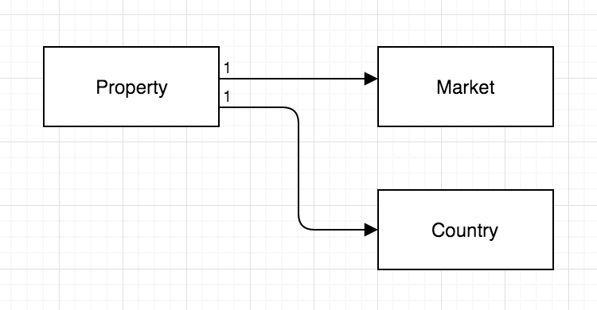

# Test - Stories

Build a javascript application that handles properties locations.

## 1. Mapping

### 1.1 
As Real Estate agent
I need to visualize all the actual properties location in the system in a map.
I need a map with all the properties in the system so that i can find the best place for a new one.

#### Done Criteria:

    - Pin locations over google maps.
    - Centered in Manhattan.

### 1.2
As a Real Estate agent,
I want to click a property (in the map) and read all the information of that property,
So that I see the basic information of a property in the context of it's geography.

#### Done Criteria:

    - Click on the pin -> open lightbox with: Name, Address, Market.
    - Lightbox shoud have a Close button.
    - If lightbox open -> you can´t interact with the map.

## 2. Entity Management (CRUD - Grid & forms)

### 2.1 
As a Real Estate Agent
I need to add & edit properties in the system
So that I can manage it later.

#### Done Criteria
    - Add & Edit Form
    - Validation
        - Required: name, address, market, lat, long.
    - Optional:
        - select a pin on a map to get latitud and longitud 

### 2.2 
As a Real Estate Agent
I need to visualize a list of all the properties in the system in a grid.
So that I can easily find a property by its name and market.

#### Done Criteria
    - Grid showing all properties. Ordered by name desc.
    - Click on name -> opens the edit form. After saving the change should be reflected on the grid.

# More Information:

  - clone and install: https://github.com/WeConnect/physical-systems-api-test
  - Api handling and documentation (how to interact with the api): https://github.com/typicode/json-server
  - Entity Relations:
  